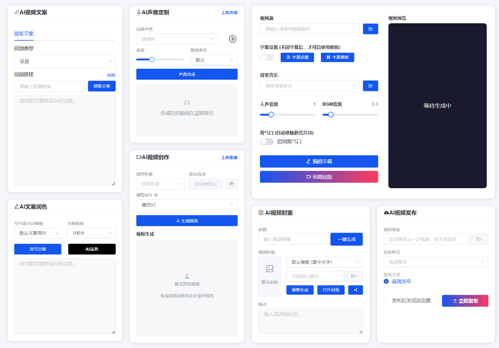

# AI爆款口播视频智能体

---

## 工作页面


---

## 核心特性
- AI提取短视频文案
- AI语音与视频合成
- AI批量短视频创作
- AI全自动视频剪辑
- AI全自动做IP账号
- AI本地创作无限量
- AI一键分发多平台

---

## 自动出片
- 自动提取对标文案 
- 自动进行文案仿写 
- 自动根据文案声音克隆 
- 自动生成数字人口播 
- 自动添加字幕 
- 自动添加背景音乐 
- 自动添加视频标题 
- 自动生成视频封面
- 自动将视频发布到各平台（某抖，某号、某手，某书）

---

## 核心功能

- 自动提取并处理对标视频口播文案
- 文案语义级仿写与结构重组
- 高保真语音克隆与合成
- 数字人口播视频自动生成
- 自动生成字幕、背景音乐、标题与封面
- 多平台视频自动发布
- 全流程本地运行，无云端依赖

- 极速克隆
仅需 1秒视频或1张照片，30秒内完成数字人形象与声音克隆，60秒内生成4K视频。
- 多语言支持
克隆后的数字人音色支持 中文、英语、日语、韩语、法语、德语、阿拉伯语、西班牙语 8种语言输出。
- 高精度口型同步
在侧脸、遮挡或复杂光影环境下，仍能 100%精确匹配发音口型，表情与肢体动作自然流畅。
- 完全本地化
数据 无需上传云端，全程离线运行，保障隐私安全。
- 零成本使用
免费开源，无授权费、不限克隆次数与视频时长，支持无限量生成。
- 低门槛部署
提供 图形化界面，无需编程基础，支持 Windows/Linux 系统一键安装。

---

## 自动化流程

```text
对标文案提取
        ↓
文案仿写与优化
        ↓
语音合成与克隆
        ↓
数字人口播生成
        ↓
字幕 / BGM / 封面合成
        ↓
多平台发布
```

---

## 技术栈

| 模块    | 技术方案                      |
| ----- | ---------------------------    |
| 语音识别  | Whisper                     |
| 语音合成  | CosyVoice                   |
| 数字人驱动 | HeyGem                     |
| 视频处理  | FFmpeg                      |
| 自动发布  | social-auto-upload          |

---

## 硬件与安装要求
- 最低配置
显卡：NVIDIA 1080Ti 或更高（必须支持 CUDA 11.8+），显存建议 ≥8GB。
内存：32GB（官方推荐），最低 16GB 可运行但效率受限。
存储：本地硬盘空间 ≥100GB（模型文件及生成视频占用较大）。

- 部署方式
一键安装包：硅基智能提供 预配置的软件安装包（非纯代码仓库），简化本地部署流程，适合非技术用户。
Docker 部署：支持通过 docker-compose 快速启动，兼容 Windows 和 Linux 系统。
国内加速：因 GitHub 访问可能受限，国内用户可通过 镜像站（如 ghproxy.com）加速克隆仓库。

---

## 适用场景与限制
- 内容创作
短视频口播、课程录制、虚拟主播等，替代付费数字人服务。
- 企业营销
产品介绍视频、品牌虚拟代言人、客服数字人，降低人力与制作成本。
- 教育与培训
虚拟讲师、多语言教学内容生成，适配跨国教育需求。

---

## 致谢

基于以下优秀开源项目构建,表示感谢：
* [Whisper](https://github.com/openai/whisper)
* [CosyVoice](https://github.com/tencent-ailab/cosyvoice)
* [HeyGem](https://github.com/duixcom/Duix-Avatar)
* [social-auto-upload](https://github.com/dreammis/social-auto-upload)
* [FFmpeg](https://github.com/FFmpeg/FFmpeg) 

